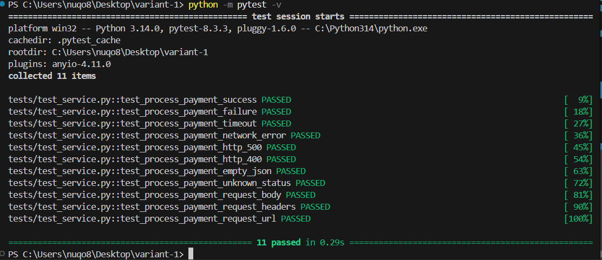

# Практическая работа №4 — Мокирование в тестировании  
Вариант 1 — Мокирование HTTP API (платёжный шлюз)

## Описание проекта
Проект содержит сервис `PaymentService`, который отправляет POST-запрос во внешний платежный API,  
и набор модульных тестов `test_service.py`, полностью изолированных с помощью мокирования.

Тесты покрывают:
- успешный платёж
- отказ банка
- таймаут
- сетевую ошибку
- HTTP-ошибки 400/500
- пустой JSON
- неизвестный статус
- проверку тела запроса
- проверку заголовков
- проверку URL

---

## Установка и запуск тестов

### 1. Установка зависимостей
```bash
pip install -r requirements.txt
```

### 2. Запуск тестов
```bash
pytest -v
```

---

## Скриншоты

### ✔ Успешный запуск тестов  



---

## 🧪 Используемые технологии
- Python 3.10+
- pytest
- unittest.mock
- requests
